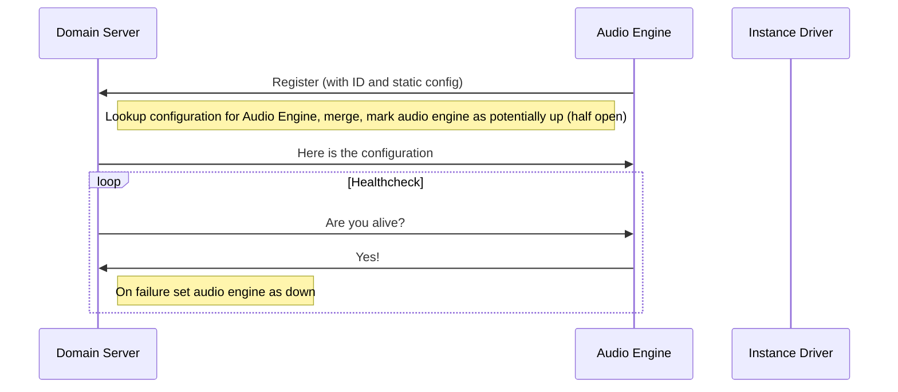

# Flows

## Standalone boot flow

```mermaid
sequenceDiagram
    participant Domain Server
    participant Audio Engine
    participant Instance Driver
    
    Audio Engine->>Domain Server: Register (with ID and static config)
    Note right of Domain Server: Lookup configuration for Audio Engine, merge, mark audio engine as potentially up (half open)
    Domain Server->>Audio Engine: Here is the configuration
    
    loop Healthcheck
        Domain Server->>Audio Engine: Are you alive?
        Audio Engine->>Domain Server: Yes!
        Note right of Domain Server: On failure set audio engine as down
    end
```

## Orchestrated boot flow

## Reservation flow

## Play flow

## Render flow

## Stop and render Cancel flow

## Error flow

## Reservation cancel flow